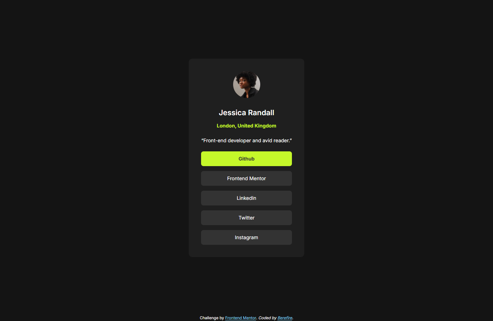
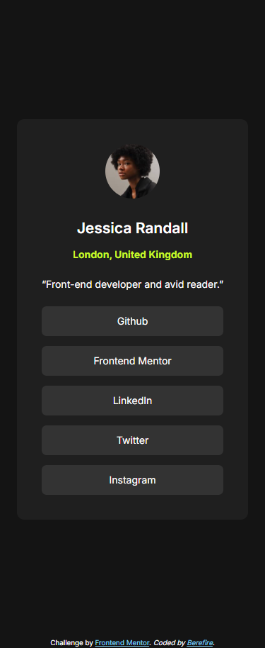

# Frontend Mentor - Social links profile solution

This is a solution to the [Social links profile challenge on Frontend Mentor](https://www.frontendmentor.io/challenges/social-links-profile-UG32l9m6dQ). Frontend Mentor challenges help you improve your coding skills by building realistic projects.

## Table of contents

- [Overview](#overview)
  - [The challenge](#️the-challenge)
  - [Screenshot](#screenshot)
    - [Desktop](#desktop)
    - [Hover state](#hover-state)
    - [Mobile](#mobile)
  - [Links](#links)
- [My process](#my-process)
  - [Built with](#️built-with)
  - [Features](#features)
  - [What I learned](#what-i-learned)
  - [Accessibility](#accessibility)
  - [Continued development](#continued-development)
  - [Useful resources](#useful-resources)
- [Author](#author)
- [Acknowledgments](#acknowledgments)

## 📋Overview

The goal of this challenge was to recreate the card layout as closely as possible to the provided design, using semantic HTML, modern CSS, and good accessibility practices.

### 🎖️The challenge

Users should be able to:

- See hover and focus states for all interactive elements on the page.

### 📸Screenshot

#### Desktop

#### Hover state

#### Mobile

### 🔗Links

- Solution URL: 
- Live Site URL: 

## My process

### 🛠️Built with

- Semantic HTML5 markup
- CSS custom properties
- Flexbox
- CSS Grid
- Mobile-first workflow
- BEM methodology
- Accessible markup (WCAG 2.1 AA)

### ✨Features

- Responsive card layout
- Hover and focus states for interactive elements
- Keyboard-accessible navigation
- High color contrast and readable typography
- Clean and scalable CSS architecture

### 📚What I learned

During this project I reinforced:

- How to apply **BEM naming conventions** correctly
- The importance of using **real interactive elements** instead of only visual cues
- How to improve **accessibility** with `aria-labelledby` and `:focus-visible`
- Writing cleaner, more maintainable CSS using variables

### ♿Accessibility

This project follows basic **WCAG 2.1 AA** guidelines:

- Semantic HTML structure
- Sufficient color contrast
- Keyboard-accessible links
- Visible focus states
- Descriptive alternative text for images.

### 🚀Continued development

In future projects, I want to:

- Improve animation and micro-interactions
- Explore CSS Grid for more complex layouts
- Continue refining accessibility best practices

### 📖Useful resources

- [MDN Web Docs](https://developer.mozilla.org/) - A great encyclopedia to consult CSS properties.
- [CSS Tricks Flexbox Guide](https://css-tricks.com/snippets/css/a-guide-to-flexbox/) - This is an amazing article which helped me finally understand Flexbox. I'd recommend it to anyone still learning this concept.
- [CSS Tricks Grid Guide](https://css-tricks.com/css-grid-layout-guide/) - This guide helps you to understand the Grid Properties.
- [Google Fonts](https://fonts.google.com/) - In this site you can obtain any font that you want to design your web site.

## 👤Author

- Frontend Mentor - [@berefire](https://www.frontendmentor.io/profile/berefire)
- GitHub - [@berefire](https://github.com/berefire)

## 🙏Acknowledgments

Thanks to Frontend Mentor for providing high-quality challenges that help developers grow through practice.
